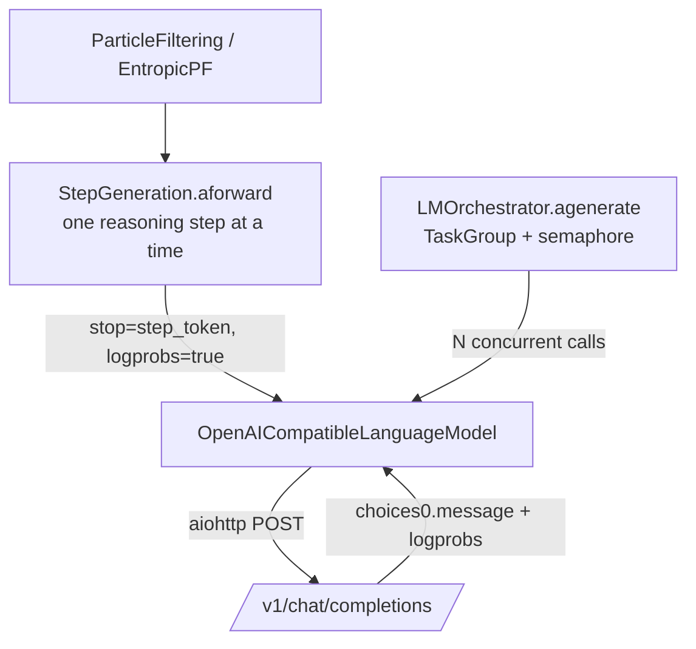

# Chapter 3 — Generating Text: The Machinery (and How Logprobs Flow)

> *Previous: [Architecture](02-architecture.md) · Next: [Particle Filtering](07-particle-filtering.md)*

This chapter follows a single generation request from an algorithm down to the HTTP call and back. Pay
special attention to the last section — it answers one half of the user's headline question:
*"are they getting just the output from the model, or are they getting log-weights too?"* The answer,
which we prove from the code, is **text plus the model's own token logprobs** — Particle Filtering
always requests them, and they are the raw material of the particle weights.

## Three pieces of machinery



There are **two ways** to drive the LM:

1. The **orchestrator** fans out a batch of complete-response requests concurrently — this is the
   gateway-facing seam (no built-in algorithm currently uses it).
2. **`StepGeneration`** asks the LM for *one reasoning step at a time* — this is what Particle
   Filtering drives, batching all particles into a single call per step.

We take them in turn.

## The language model: `OpenAICompatibleLanguageModel`

This is the production implementation of `AbstractLanguageModel`, talking to any OpenAI-compatible
endpoint — OpenAI itself, or a local **vLLM** server.
([`its_hub/core/lms/openai_lm.py`](../its_hub/core/lms/openai_lm.py))

A few design points worth knowing:

- **Async with per-event-loop session caching.** Sessions live in a
  `weakref.WeakKeyDictionary[loop -> ClientSession]` ([`openai_lm.py:100-105`](../its_hub/core/lms/openai_lm.py#L100-L105)),
  so each event loop reuses one HTTP session and the entry is garbage-collected with the loop. You are
  expected to `await lm.close()` (or use `async with lm:`) for clean shutdown
  ([`openai_lm.py:129-161`](../its_hub/core/lms/openai_lm.py#L129-L161)).
- **Retries with exponential backoff.** Both `agenerate_single` and the legacy `_agenerate` wrap the
  HTTP call (the inner `fetch_response`) in
  `@backoff.on_exception(backoff.expo, RETRYABLE_ERRORS, max_tries=...)` and can optionally swallow
  errors into a placeholder message via `replace_error_with_message`.
- **vLLM vs OpenAI quirks.** For vLLM endpoints it can set `add_generation_prompt=False` /
  `continue_final_message=True` so a partially-written assistant turn is *continued* rather than
  restarted — essential for step-by-step generation (see the `endpoint_type == "vllm"` branch of
  `_prepare_request_data`).
- **`agenerate` is deprecated** in favor of `agenerate_single` + orchestrator — but note it is still
  the batch path `StepGeneration` uses to advance all particles in one call.

### What goes *out* in the request

The request body is assembled in `_prepare_request_data`
([`openai_lm.py`](../its_hub/core/lms/openai_lm.py)). It can contain `model`, `messages`, `stop`,
`max_tokens`, `temperature`, `tools`, `tool_choice`, and `response_format` — and, when the caller asks
(`logprobs=True`, optionally `top_logprobs=k`), a **`logprobs` field requesting token probabilities**:

```python
# its_hub/core/lms/openai_lm.py (_prepare_request_data, end)
# request token logprobs (used to derive self-certainty particle weights)
if logprobs:
    request_data["logprobs"] = True
    if top_logprobs is not None:
        request_data["top_logprobs"] = top_logprobs
```

Particle Filtering *always* sets this (it calls `StepGeneration.aforward(..., return_logprobs=True)`),
so in practice every PF step request carries `logprobs: true`.

### What comes *back* in the response

```python
# its_hub/core/lms/openai_lm.py (inside agenerate_single)
response_json = await response.json()
choice = response_json["choices"][0]
message = dict(choice["message"])
if choice.get("logprobs") is not None:
    message["_logprobs"] = choice["logprobs"]
if self.include_raw_choices:
    message["_raw_choice"] = {**choice, "message": dict(choice["message"])}
return message
```

`choice["message"]` is extracted — i.e. `{"role", "content", "tool_calls"}` — and, when the server
returned them, the token-level `logprobs` object is attached as `message["_logprobs"]`. (With
`include_raw_choices=True` the whole *choice* object — index, message, finish_reason — is preserved
too.)

> ### ⛳ The pivotal fact
> **The LM hands back text (and tool calls) *plus*, when asked, its own token log-probabilities.** A
> particle's "log weight" comes *entirely* from those generator logprobs — there is no separate reward
> model anywhere in the library. Each step's `_logprobs` is condensed by `summarize_step_logprobs`
> (`its_hub/core/utils.py`) into `mean_logprob` / `entropy`, which the algorithm turns into a
> log-weight. We will see the exact line in [Chapter 7](07-particle-filtering.md).

## The orchestrator: structured concurrency

When a caller wants a *batch* of complete responses, it doesn't loop — it hands the batch to the
orchestrator. The built-in `LMOrchestrator`
([`its_hub/core/orchestrator.py`](../its_hub/core/orchestrator.py)) fans out with Python 3.11's
`asyncio.TaskGroup` and bounds concurrency with a **thread-safe** semaphore:

```python
# its_hub/core/orchestrator.py:115-141
async def _gen_coro(messages, temp):
    ctx = self._semaphore if self._semaphore is not None else contextlib.nullcontext()
    async with ctx:
        return await lm.agenerate_single(messages, stop=stop, max_tokens=max_tokens,
                                          temperature=temp, ..., loop=current_loop)

async with asyncio.TaskGroup() as tg:
    tasks = [tg.create_task(_gen_coro(msgs, temp))
             for msgs, temp in zip(messages_lst, temperature_list)]
responses = [task.result() for task in tasks]   # collected in input order
```

Two subtleties:

- **`TaskGroup` gives structured concurrency**: all child tasks complete together, and if one raises,
  the group cancels the rest and propagates an `ExceptionGroup`. No orphaned tasks.
- **The semaphore is a `threading.Semaphore` wrapped for async use**
  ([`orchestrator.py:13-44`](../its_hub/core/orchestrator.py#L13-L44)), so the concurrency cap holds
  *across event loops and threads* — important when the same orchestrator is reused from a sync wrapper
  that spins up fresh loops. Default `max_concurrency=32`; `-1` means unlimited.

This is the seam a gateway team customizes: implement `AbstractOrchestrator` with your own rate-limiting
policy. (Note: Particle Filtering itself currently bypasses the orchestrator and batches through
`StepGeneration` — the orchestrator is kept as the gateway integration point.)

## `StepGeneration`: one reasoning step at a time

Particle Filtering doesn't want a whole answer — it wants to grow a solution *step by step* so each
step can be weighted as it lands. `StepGeneration`
([`its_hub/core/lms/step_generation.py`](../its_hub/core/lms/step_generation.py)) is the adapter that
turns the LM into a step emitter.

You configure it with **exactly one** of:

- `step_token` (e.g. `"\n\n"`): generate until that delimiter appears — that's one "step".
- `tokens_per_step` (an int): generate a fixed number of tokens per step.

…plus a `max_steps` cap and an optional `stop_token` (e.g. `r"\boxed"`) that signals the final answer.

The heart is `aforward`, which builds the running prompt and calls the LM with `stop=step_token`:

```python
# its_hub/core/lms/step_generation.py (aforward, single-prompt path)
next_step_response = await lm.agenerate(
    messages, stop=self.step_token, max_tokens=self.tokens_per_step,
    temperature=self._get_temperature(messages),
    include_stop_str_in_output=self.include_stop_str_in_output, tools=tools, tool_choice=tool_choice,
    **logprob_kwargs,
)
next_step = extract_content_from_lm_response(next_step_response)
is_stopped = len(steps_so_far) >= self.max_steps
if self.stop_token:
    is_stopped = is_stopped or self.stop_token in next_step
if return_logprobs:
    summary = summarize_step_logprobs(next_step_response.get("_logprobs"))
    return next_step, is_stopped, summary
return next_step, is_stopped
```

Four things to notice:

1. **The "is this done?" decision is made *here*, not by the model's `finish_reason`.** A step-by-step
   trajectory stops when it hits `max_steps` **or** the `stop_token` appears in the generated text.
2. **The growing trajectory is replayed each step.** Prior steps are folded back into the prompt as an
   assistant message via `_post_process`, and `aforward` has a **batched** path so *all* particles
   advance one step in a single batched LM call.
3. **`aforward(..., return_logprobs=True)` returns a third element per step** — the
   `summarize_step_logprobs` dict (`mean_logprob`, `entropy`, `num_tokens`) condensed from the
   `_logprobs` the LM attached. Particle Filtering always passes `return_logprobs=True` (plus its
   `top_logprobs` setting); the logprob kwargs are only forwarded to the LM when requested, so LMs and
   mocks that predate logprob support keep working unchanged.
4. **`_post_process(steps, stopped=True)`** reassembles the steps into the full response string — this
   exact string becomes the particle's entry in `ParticleFilteringResult.responses`.

### `ChatMessage` / `ChatMessages`

Everything above speaks in `ChatMessage` (a `role` + `content` + optional `tool_calls`/`tool_call_id`
dataclass) and the `ChatMessages` wrapper that normalizes a bare string, a message list, or an existing
wrapper ([`its_hub/api/types.py`](../its_hub/api/types.py)). Two helpers you'll see constantly:

- `to_batch(size)` — make `size` identical copies of a conversation for parallel sampling
  ([`types.py:101-104`](../its_hub/api/types.py#L101-L104)). This is how `budget` becomes N requests.
- `to_prompt()` — flatten a conversation back to a single string, used by the step-by-step path, which
  still passes prompts as strings ([`types.py:106-131`](../its_hub/api/types.py#L106-L131)).

---

With text *and* token logprobs flowing, we can watch the algorithm turn those logprobs into the numbers
it optimizes: the **particle weights**.

*Next: [Chapter 7 — Particle Filtering](07-particle-filtering.md).*
