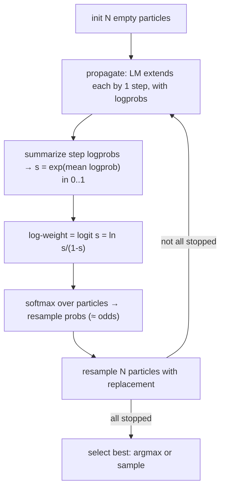

# Chapter 7 — Particle Filtering: Where Self-Certainty Becomes Log-Weight

> *Previous: [Generating Text](03-generating-text.md) · Next: [Entropic Particle Filtering](08-entropic-particle-filtering.md)*

This is the chapter the deep-dive was commissioned for. By the end you will know **exactly** how a
particle's "log weight" is computed, line by line, and be able to answer the question that started it
all: *are they multiplying or adding?* Short answer up front, then the full derivation:

> **Per particle, the weight at step $t$ is the *logit* of the generator's own confidence in the step
> it just produced** — $s_t = \exp(\text{mean per-token logprob}) \in (0,1]$ — re-derived each step,
> **not** accumulated by a running sum or product in the filter. **Across particles**, the weights are
> turned into a resampling distribution with a **softmax**, so particle $i$'s resample probability is
> $\propto \frac{s_i}{1-s_i}$ (its *odds*). Any *product* of per-token probabilities happens **inside
> the step summary** (the mean logprob is a log of a geometric mean), never in the filter itself.

All code in this chapter is from
[`its_hub/core/algorithms/particle_filtering.py`](../its_hub/core/algorithms/particle_filtering.py).
There is no separate reward model anywhere: the only weight source is **self-certainty** — the
generator's own token logprobs, which `StepGeneration` returns because PF always requests them
(`return_logprobs=True` internally).

## The big idea: inference scaling as Sequential Monte Carlo

Particle filtering reframes "search for a good answer" as **sampling from a confidence-tilted distribution**.
Imagine the distribution over reasoning trajectories where good trajectories (high self-certainty) are more
likely. We can't sample it directly. So we use **Sequential Monte Carlo (SMC)**, a.k.a. a *particle
filter*:

1. **Sample** a population of $N$ trajectories ("particles"), all starting empty.
2. **Propagate**: extend every particle by one reasoning step (using the LM, with logprobs).
3. **Weight**: summarize the generator's own token logprobs for the step it just produced
   (self-certainty) and turn that confidence into a weight.
4. **Resample**: draw a new population of $N$ particles *with replacement*, in proportion to the
   weights. Good particles get cloned; bad ones die out.
5. Go to 2 until all particles finish. Return the best surviving particle.

This is the classic *sample → weight → resample* loop of the bootstrap particle filter (Gordon, Salmond
& Smith 1993; Doucet, de Freitas & Gordon 2001), applied to LLM reasoning by Puri et al. (2025). See
[Chapter 99](99-glossary-and-references.md) for citations.



## A particle, precisely

```python
# its_hub/core/algorithms/particle_filtering.py — Particle
@dataclass
class Particle:
    steps: list[str]
    is_stopped: bool
    partial_log_weights: list[float]   # one entry per step taken

    @property
    def log_weight(self) -> float:
        """Return the most recent log weight."""
        if self.partial_log_weights:
            return self.partial_log_weights[-1]
        return 0.0
```

Two facts that matter enormously:

- `partial_log_weights` is a **list** that grows by one entry per step — it stores a *history*.
- But `log_weight`, the number used for resampling and selection, is **`partial_log_weights[-1]`** —
  the **latest** one, **not** the sum or product of the list. The history is a per-step record (useful
  for inspection), not an accumulator.

## The weight, line by line

Inside `_apropagate`, the LM extends each particle by one step **with logprobs**
(`self.sg.aforward(..., return_logprobs=True, top_logprobs=self.top_logprobs)`), and
`summarize_step_logprobs` reduces the new step's token logprobs to a summary dict. That summary is
converted to a log-weight by `ParticleFiltering._self_certainty_logweight`:

```python
# its_hub/core/algorithms/particle_filtering.py — _apropagate
next_step, step_is_stopped, summary = sg_forward_results[i]
p.steps.append(next_step)
p.is_stopped = step_is_stopped
p.partial_log_weights.append(self._self_certainty_logweight(summary))   # ← confidence → log-weight
```

```python
# its_hub/core/algorithms/particle_filtering.py — _self_certainty_logweight (condensed)
if self.self_certainty_signal == "entropy":
    c = -float(summary["entropy"])            # c = -mean per-token entropy
else:
    c = float(summary["mean_logprob"])        # c = mean per-token logprob

if self.self_certainty_style == "raw":
    return c                                  # use c directly as the log-weight
s = float(np.exp(min(c, 0.0)))                # s = exp(c) in (0, 1]
return _inv_sigmoid(s)                        # style "logit"
```

Both signals reduce to a confidence in log-space, $c \le 0$, where $s = e^c \in (0,1]$ is a per-token
confidence: `'mean_logprob'` uses the mean per-token logprob of the step; `'entropy'` uses the
negative mean per-token entropy over the top-k alternatives (which is why `'entropy'` forces
`top_logprobs`, defaulting it to 20). Style `'raw'` skips the transform and uses $c$ as-is; style
`'logit'` (the default) applies the **inverse sigmoid**, i.e. the **logit**, to $s$
(`_inv_sigmoid` in `its_hub.core.algorithms.particle_filtering`):

```python
def _inv_sigmoid(x):
    assert 0 <= x <= 1, "x must be between 0 and 1"
    x = np.clip(x, 1e-7, 1 - 1e-7)     # avoid log(0) / log(inf)
    return np.log(x / (1 - x))
```

### The math of the weight

The step summary yields a probability-like score $s_t = e^{c_t} \in (0,1]$ for the step generated at
$t$ (a per-token confidence: $e^{\text{mean logprob}}$, or $e^{-\text{mean entropy}}$ for the entropy
signal). With the default `'logit'` style, the particle's log-weight at step $t$ is

$$
w_t \;=\; \operatorname{logit}(s_t) \;=\; \ln\!\frac{s_t}{1-s_t}.
$$

This is the **log-odds** of the confidence. It maps the bounded score onto the whole real line: $s=0.5 \to 0$,
$s\to 1 \Rightarrow w\to +\infty$, $s\to 0 \Rightarrow w\to -\infty$. Working in log-space is the
numerically stable home for weights — it is the natural domain for the softmax that follows.

> **Why logit and not just $\ln s$?** Because the resampling step exponentiates the weight. With
> $w=\operatorname{logit}(s)$, $\exp(w) = \frac{s}{1-s}$ — the **odds**. So a particle's *unnormalized*
> resampling mass is its odds of being "good," which sensibly amplifies differences near $s=1$ (a step
> the generator is very confident about) and is symmetric about $s=0.5$. (Style `'raw'` is the
> $w_t = c_t = \ln s_t$ alternative, available via `self_certainty_style="raw"`.)

## Resampling: from weights to a new population

Each outer step, the filter gathers one weight per particle — its **most recent** log-weight (stopped
particles keep their final one) — turns them into probabilities, and resamples
(`ParticleFiltering.ainfer` in
[`particle_filtering.py`](../its_hub/core/algorithms/particle_filtering.py)):

```python
# its_hub/core/algorithms/particle_filtering.py — ainfer (main loop)
log_weights = [p.log_weight for p in particles]
probabilities = self._weights_to_probabilities(log_weights, current_step, num_particles)
particles = [p.deepcopy() for p in self._resampling(particles, probabilities, num_particles)]
```

`_weights_to_probabilities` is just an untempered `_softmax(log_weights)` in plain PF — it exists as a
hook so Entropic PF can override it with temperature annealing (see Chapter 8). The softmax
(`_softmax` in the same module) is the standard numerically-stable form. Its effect on our logit
weights is illuminating:

$$
P(\text{resample } i) \;=\; \frac{e^{w_i}}{\sum_j e^{w_j}}
\;=\; \frac{\frac{s_i}{1-s_i}}{\sum_j \frac{s_j}{1-s_j}}.
$$

**A particle is resampled in proportion to its odds, normalized across the population.** That single
equation is the entire selection mechanism of the particle filter.

### Two resampling schemes

```python
# its_hub/core/algorithms/particle_filtering.py
def _resampling_multinomial(self, particles, probabilities, num_particles):
    return random.choices(particles, weights=probabilities, k=num_particles)
```

- **Multinomial** (default for plain PF): draw $N$ particles i.i.d. from the categorical distribution.
  Simple, higher variance.
- **Systematic** (`_resampling_systematic` in the same module):
  one uniform random offset, then evenly-spaced "comb" positions over the cumulative distribution. Lower
  variance, better diversity — and the default for **Entropic** PF (Chapter 8).

After resampling, survivors are `deepcopy`-d so clones diverge independently.

## The "multiply vs add" question, settled

Let's answer it from three angles, because it's subtle.

**1. Across *steps*, within one particle — neither add nor multiply (in the filter).**
The weight used at step $t$ is `partial_log_weights[-1]` $= \operatorname{logit}(s_t)$. The code never
computes $\sum_t w_t$ or $\prod_t s_t$ over the particle's own history. Each step's weight *overwrites*
the role of "the weight" — it is **per-step**, derived only from the tokens of the step just generated,
re-derived fresh after every propagation, never accumulated.

**2. Inside the step summary — multiplication *does* happen (as a geometric mean).**
`summarize_step_logprobs` averages the per-token logprobs of the step, so
$s_t = e^{\bar{\ell}_t} = \big(\prod_k p_k\big)^{1/n}$ — the **geometric mean** of the step's token
probabilities. So the only "product of probabilities" lives **inside the summary of one step**, before
the filter. The filter is agnostic — it logit-transforms whatever scalar confidence it gets (mean
logprob, or $e^{-\text{mean entropy}}$ for the entropy signal).

**3. Across *particles* — softmax (which is "add in log-space, then normalize").**
Resampling combines particles' weights via $\frac{e^{w_i}}{\sum_j e^{w_j}}$. The denominator is a sum of
exponentials of log-weights — i.e. the weights *interact additively in log-space* to form a probability
distribution, never multiplicatively.

So if someone asks "do they add or multiply the log-weights?", the precise answer is:
**the filter takes the logit of the step's per-token confidence (a geometric mean of token
probabilities) as the instantaneous log-weight, and combines particles via softmax — it does not itself
accumulate a per-particle weight across steps by either summing or multiplying.** A runnable
demonstration that prints every particle's `partial_log_weights` and the resulting softmax
probabilities is in [`snippets/epf_logweights_demo.py`](snippets/epf_logweights_demo.py); the full
logprobs → scalar → log-weight pipeline (both styles) is walked through in
[`snippets/self_certainty_demo.py`](snippets/self_certainty_demo.py).

## Degeneracy: why naive weighting isn't enough

There is a well-known pathology in particle filters called **weight degeneracy**: after a few steps,
almost all the probability mass concentrates on a single particle, and resampling just makes $N$ copies
of it. Diversity collapses; you've effectively spent $N×$ compute to follow one path. The standard
diagnostic is the **Effective Sample Size**
(`EntropicParticleFiltering._effective_sample_size` in
[`particle_filtering.py`](../its_hub/core/algorithms/particle_filtering.py)):

$$
\mathrm{ESS} \;=\; \frac{1}{\sum_i p_i^{\,2}} \quad\in [1, N].
$$

If all particles are equal, $\mathrm{ESS}=N$ (healthy). If one dominates, $\mathrm{ESS}\to 1$ (degenerate).
Plain `ParticleFiltering` computes weights and resamples but does **not** act on ESS. Fixing degeneracy
— keeping the swarm diverse early — is precisely what **Entropic** Particle Filtering adds, and the ESS
is the trigger it watches. That's the next chapter.

## Constructing it, budget, selection, and the result

The constructor, in full:

```python
ParticleFiltering(
    sg,                                     # StepGeneration (step/stop tokens, max_steps)
    final_response_selection="argmax",      # or "sample"
    resampling_method="multinomial",        # or "systematic"
    self_certainty_signal="mean_logprob",   # or "entropy"
    self_certainty_style="logit",           # or "raw"
    top_logprobs=None,                      # per-token top-k; forced to 20 if signal="entropy"
)
```

There is no `prm=` and no `weight_source=` — self-certainty is the only weight source.
`ParticleFiltering` runs a **single** sample→weight→resample pass (no Gibbs iterations), so
**`budget = num_particles`** directly in `ainfer`. The final answer is chosen from the surviving
population by `final_response_selection`:

- `ARGMAX` (default): the particle with the highest final log-weight.
- `SAMPLE`: draw one in proportion to the final softmax probabilities.

`ParticleFilteringResult` (in
[`particle_filtering.py`](../its_hub/core/algorithms/particle_filtering.py))
carries the surviving `responses`, the per-particle `log_weights_lst`, the `selected_index`, and
`steps_used_lst`; `the_one` returns `responses[selected_index]`. Inspecting `log_weights_lst` is the
best way to *see* how compute concentrated.

---

*Next: [Chapter 8 — Entropic Particle Filtering](08-entropic-particle-filtering.md): the namesake, and
the cure for degeneracy.*
