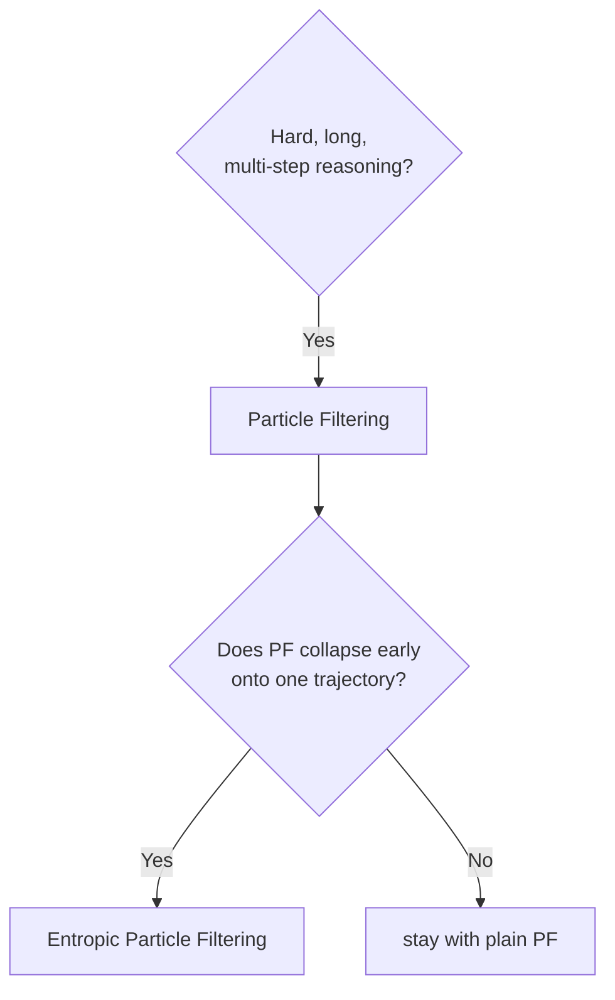

# Chapter 11 — Putting It Together

> *Previous: [Entropic Particle Filtering](08-entropic-particle-filtering.md) · Next: [Running It](12-running-it.md)*

We've met every component. This chapter zooms back out: one end-to-end trace, a decision guide, and the
mental model that ties the pair together.

## One request, end to end

Here is a Particle-Filtering request from prompt to answer, naming the real components at each hop:

```mermaid
sequenceDiagram
    participant U as You
    participant ALG as ParticleFiltering (ainfer)
    participant SG as StepGeneration
    participant LM as OpenAICompatibleLanguageModel
    U->>ALG: infer(lm, prompt, budget=N)
    Note over ALG: init N empty particles
    loop until all particles stopped
        ALG->>SG: aforward(lm, prompts, steps_so_far, return_logprobs=True)  (batched)
        SG->>LM: agenerate(stop=step_token, logprobs)  per particle
        LM-->>SG: next step + token logprobs
        SG-->>ALG: (next_step, is_stopped, logprob summary) per particle
        Note over ALG: c = mean step logprob; w = logit(exp c); softmax over particles; resample
    end
    ALG-->>U: the_one (argmax log-weight)
```

The same skeleton describes Entropic PF — the only difference is that the softmax over particles is
tempered (the `_weights_to_probabilities` override from Chapter 8).

In code, the whole stack is four imports:

```python
from its_hub import (
    ParticleFiltering,            # or EntropicParticleFiltering
    StepGeneration,
    OpenAICompatibleLanguageModel,  # needs the [lm] extra
)

lm = OpenAICompatibleLanguageModel(endpoint=..., api_key=..., model_name=...)
sg = StepGeneration(step_token="\n\n", max_steps=32)
result = ParticleFiltering(sg).infer(lm, problem, budget=8)   # budget = number of particles
```

## The data, in one picture

```text
   prompt ──▶ LM(text + logprobs) ──▶ step summary(number) ──▶ log-weight ──▶ selection ──▶ the_one
              │                            │                       │              │
        the step's own            c = mean logprob          PF/ePF: logit(e^c)  softmax-resample,
        token logprobs            (or -mean entropy)        or raw c            then argmax/sample
```

Three invariants worth re-stating because they unify everything:

1. **The model only ever emits text plus its own token logprobs** ([Chapter 3](03-generating-text.md)).
   Every weight is computed *outside* the model, from those logprobs — there is no separate reward
   model anywhere.
2. **`budget` is the universal currency** — for PF and ePF it is the number of particles
   ([README cheat-sheet](README.md#the-budget-cheat-sheet)).
3. **`the_one` is the universal output**; pass `return_response_only=False` for the receipts.

## Choosing an algorithm

The library is PF/EPF-only now, so the decision tree is short:



A pragmatic reading:

- **Particle Filtering** when exploration matters and the endpoint supports `logprobs` (vLLM does).
- **Entropic PF** when PF collapses too early on long problems — watch `log_weights_lst` / ESS
  (the repo's reason for existing).

## Cost & determinism at a glance

| Algorithm | LM calls (≈) | Reward calls | Deterministic | Needs GPU |
|---|---|---|---|---|
| Particle Filtering | `N × steps` | 0 (self-certainty) | no (resample) | no¹ |
| Entropic PF | `N × steps` | 0 (self-certainty) | no (resample) | no¹ |

¹ Only whatever serves the generator itself (e.g. a local vLLM); there is no separate reward model to
host — the weights are free, read off the generation's own logprobs.

## The mental model to keep

Everything in `its_hub` is one loop with three swappable parts:

> **generate → judge → keep**, repeated until a stopping rule fires, then **select**.

- *generate* is the LM, one step at a time via `StepGeneration` (with logprobs).
- *judge* is the generator's own confidence in the step it just wrote (self-certainty: mean logprob or
  entropy).
- *keep* is the selection rule (softmax-resample, optionally tempered).

Swap the *keep* tempering on and you go from PF to ePF. The "entropic" innovation is a refinement of the
*keep* step — temper the resampling distribution so you don't keep too narrowly, too soon.

---

*Next: [Chapter 12 — Running It](12-running-it.md): the conda env, the tests, and the inference paths on
this machine.*
